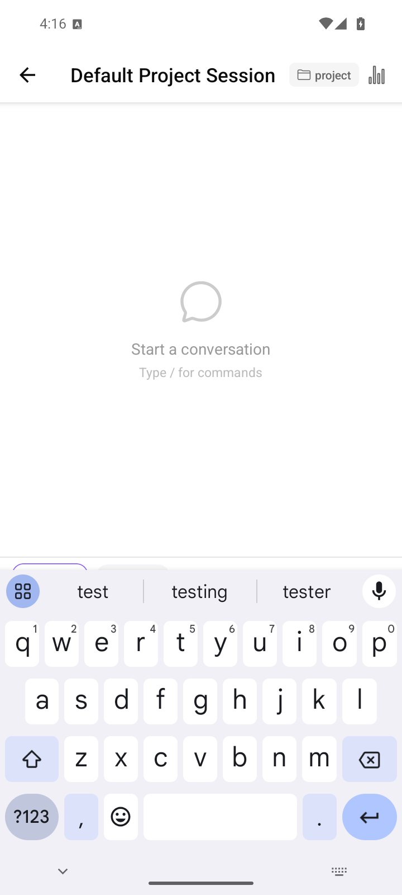
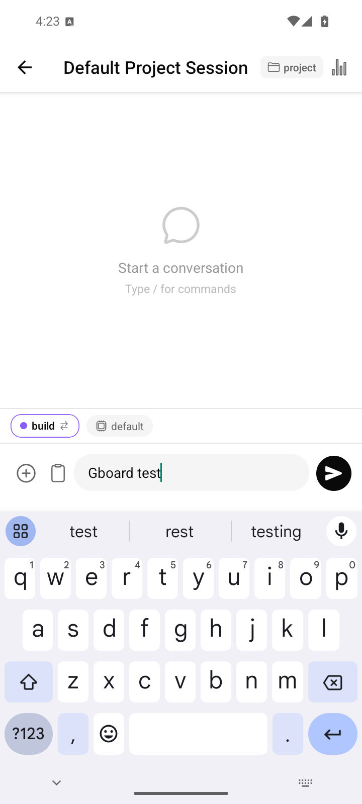
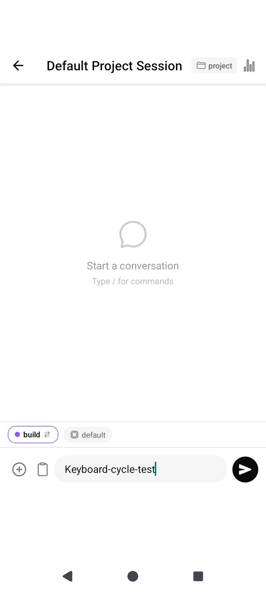
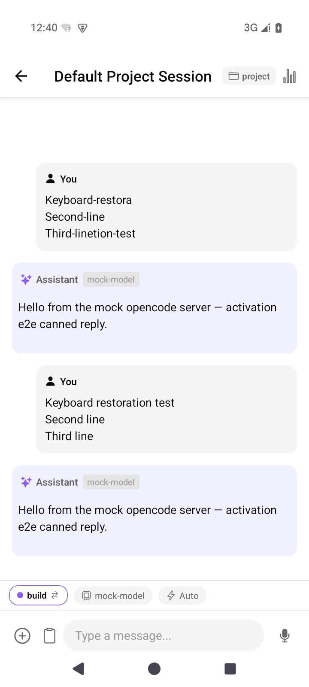

# Android keyboard layout verification

## Change

The chat measures its container position to calculate `keyboardVerticalOffset`.
On Android, `measure().pageY` uses the edge-to-edge root coordinates shared by
keyboard events. `measureInWindow()` subtracts the status bar, while safe-area
insets can also include a taller display cutout. Using the measured root
position keeps the composer and send button above Gboard without adding the
cutout height twice. iOS retains its window measurement.

## Reproduction and results

Tested on an Android 15 Pixel 6 emulator with Gboard 14.2.09.629370537,
720 × 1600 display and 280 dpi. The app connected to the repository mock server
on port 14096. A nonempty draft and the send button were checked with real UI
bounds and the Android IME frame.

- Before the fix: the composer and send button were covered by Gboard.
- After the fix: both controls ended at y=977, above the keyboard at y=1019.
  The gap was 24 dp.
- A multiline draft and three keyboard reopen cycles passed the same checks.
- Sending a draft with Gboard open reached the mock server successfully.
- The same layout fix was exercised in a signed release build without Metro.
- These checks used the earlier personal build identity. Version 0.4.16 restores
  the original package/name and leaves the tested keyboard layout code unchanged.
- A physical phone and other Android/input method combinations remain untested.

| Before | After |
| --- | --- |
|  |  |

Machine-readable results are in `docs/verification/android-keyboard/`.

To rerun, open a chat with a nonempty draft and Gboard visible, then run:

```sh
python3 -m pip install uiautomator2
python3 scripts/check-keyboard-layout.py --output-dir verification --label keyboard
```

The script requires `adb` on PATH and defaults to `emulator-5554`.
Use `--serial` for a different device. It fails if the composer is hidden, if
its controls overlap the keyboard, or if the gap below the controls exceeds 64 dp.

## Icons and version

The launcher uses a navy background with white/cyan code brackets and a cursor.
Adaptive icons include a monochrome variant. Source SVG and the generator are
checked in; run `node scripts/generate-launcher-icons.mjs` to regenerate assets.
Release metadata is 0.4.17 with versionCode 45 and package `cc.agentlabs.opencode`.


## Follow-up: restore layout after keyboard dismissal (versionCode 44)

The first fix kept the composer above Gboard, but Android's keyboard-hide event
still supplies window coordinates. React Native 0.81.5 can calculate positive
`KeyboardAvoidingView` padding from these coordinates after the IME disappears.
Enable avoidance on Android only while `Keyboard` reports it visible, keeping
the measured offset from the first fix. Remove both listeners when the screen
unmounts. The iOS behavior is unchanged.

The earlier 0.4.16 APK (versionCode 43) reproduced a 212 px (121.14 dp) extra gap
after one keyboard cycle. The signed versionCode 44 release restored the initial
composer position with 0 dp additional gap in all checks:

| Android 15 configuration | Open/close cycles | Multiline draft and send |
| --- | ---: | --- |
| Gboard 14.2.09, three-button navigation | 5 | Passed |
| Gboard 14.2.09, gesture navigation | 5 | Passed |
| AOSP keyboard, gesture navigation | 3 | Passed |

These checks ran on the 720 × 1600, 280 dpi AOSP x86_64 emulator with Metro
stopped. Both input and send controls stayed above the real IME frame. The
phone APK contains only arm64-v8a; the separately built x86_64 release used for
verification has the identical bundled JavaScript SHA-256. Both are signed with
the same personal certificate as the earlier code 43 APK, so that installation
can be updated in place. Physical phone verification remains necessary.

| Earlier APK after hide | Fixed release after hide and send |
| --- | --- |
|  |  |

Exact UI bounds, keyboard frames, APK hashes and signatures are recorded in
`docs/verification/android-keyboard-restoration/`. Type checking, version parity
and all 333 existing tests passed. A full Gradle release build succeeded.

### Reproduce the regression check

Install the signed x86_64 release on the emulator and select Gboard. Start the
fixture, reverse its port, and connect the app to `http://127.0.0.1:14096`:

```sh
node tests/fixtures/mock-opencode-server.ts --port 14096 --seed-sessions
adb reverse tcp:14096 tcp:14096
python3 -m pip install openai uiautomator2
python3 scripts/android-cua-smoke.py --scenarios keyboard_restoration --include-xml
```

The deterministic CUA scenario requires no vision API key and always records
screenshots, hierarchy XML and window frames. `ANDROID_KEYBOARD_OUTPUT_DIR`
overrides its output directory. It compares every post-hide position to a
freshly opened chat before any keyboard event; the earlier broken layout would
fail that comparison. It also verifies that the actual multiline draft appears
in the transcript after sending. This exercises the keyboard scenario only;
the separate vision-driven onboarding and coding scenarios were not run.

For another device or IME, run `scripts/check-keyboard-restoration.py` directly
with `--serial`, `--ime-package`, `--cycles`, `--multiline` and `--send`.

## Codex release: display cutouts and connection forms (versionCode 45)

The Android 15 emulator exposed a 128 px display cutout with a 42 px status
bar. Adding the safe-area inset to the window measurement left an extra 86 px
above the keyboard. Chat and connection forms now use the root-relative
`pageY` measurement. The connection form also scrolls its focused field above
the keyboard.

The signed release passed five Gboard open/close cycles, a multiline draft,
and sending with the keyboard open. All open gaps were 24 dp; all closed
positions returned to baseline with 0 dp extra gap. The result is recorded in
`docs/verification/codex-direct/keyboard.json`.
