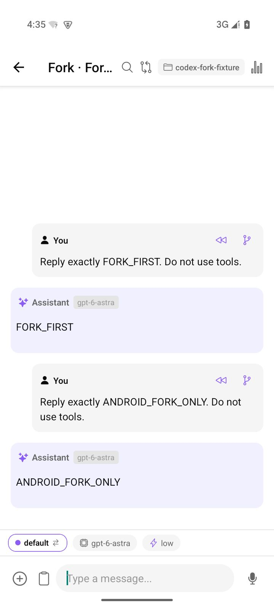

# Codex fork verification

Validated on 2026-10-04 with Codex 0.160.0, gateway 0.4.0 and Android 0.4.20 (48).

- 338 client and 28 gateway tests passed, along with TypeScript, version parity and the gateway dependency audit.
- Native tests checked full forks, forks before a selected prompt, an empty fork before the first turn, restored drafts, independent continuation, unchanged source history and unchanged files.
- A second native run used low reasoning effort, plan mode, read-only permissions and untrusted approvals. The branch retained these effective settings. Native fork restores some configuration defaults, so the gateway explicitly confirms source settings on the branch before returning it.
- Android CUA verified both entry points, preservation of the original unsent draft when navigating back, restoration of the selected prompt in the new branch, a visible branch reply, and unchanged source history.
- Both release APKs passed package, version, signing certificate, architecture and alignment checks and contain the same JavaScript bundle.

Returning from a fork also exercises the speech cleanup fix: the native module emits an expected aborted event when a chat unmounts. Other mounted chats now ignore that cancellation.

Evidence: [native](native.json), [inherited settings](native-settings.json), [Android](android.json), [APK metadata](apk-metadata.json).

## Reproduce

Set `CODEX_WORKBENCH_FIXTURE` to a dedicated absolute directory and `CODEX_WORKBENCH_REPORT` to an output JSON path. Run `node server/codex/fork-live-check.mjs`.

Install the release APK and activate a saved Codex connection. Set `CODEX_GATEWAY_URL`, `CODEX_GATEWAY_USERNAME`, `CODEX_GATEWAY_PASSWORD_FILE`, `CODEX_WORKBENCH_REPORT` and `ANDROID_CODEX_OUTPUT_DIR`. Run `python scripts/android-cua-smoke.py --scenarios codex_fork --include-xml` with uiautomator2 installed.

Forks wait for explicit input. Both conversations share the working directory and files. Finish or stop the current task before forking. Unsupported attachments require reattachment.
