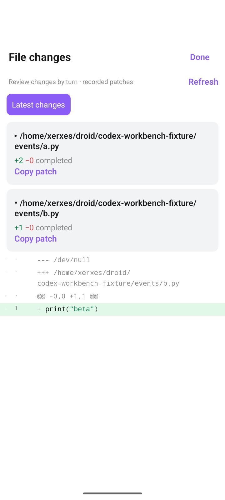
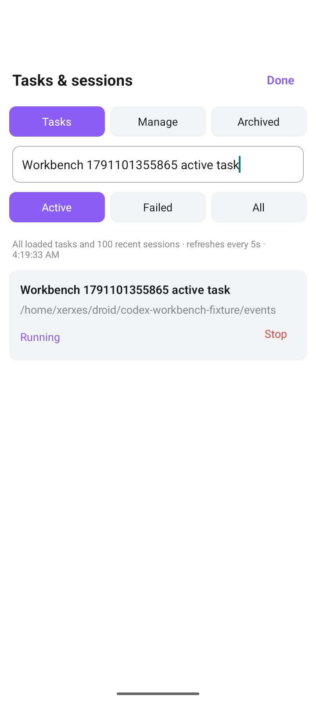

# Codex workbench verification

Validated on 2026-10-04 with Codex 0.160.0, gateway 0.3.0 and Android app 0.4.19 (47).

## Results

- 338 client tests and 25 gateway tests passed, along with TypeScript, version parity and the runtime dependency audit.
- Native integration created dedicated threads and two files. It verified history search, grouped patches, a complete backup before rewind, unchanged file hashes, a successful retry, batch archive/restore, and interruption of a running task.
- Android API 35 with Gboard passed search and message positioning, file expansion/collapse and line numbers, backup/rewind and draft restoration, a new reply after retry, batch archive/restore, and dashboard stop/status/jump behavior.
- Both signed release APKs have the expected package, version, certificate, architecture and 16 KiB alignment. Phone and emulator APKs contain the same JavaScript bundle.

Evidence: [native checks](native.json), [Android checks](android.json), [unit checks](checks.json), and [APK metadata](apk-metadata.json).

## Reproduce

Run `npm test` in the project and in `server/codex`. Run `npx tsc --noEmit` and `node scripts/check-version-parity.mjs` in the project.

For native integration, set `CODEX_WORKBENCH_FIXTURE` to a dedicated absolute directory and `CODEX_WORKBENCH_REPORT` to an output JSON path, then run `node server/codex/workbench-live-check.mjs`.

Install the release APK and activate a saved Codex connection. Set `CODEX_GATEWAY_URL`, `CODEX_GATEWAY_USERNAME`, `CODEX_GATEWAY_PASSWORD_FILE`, `CODEX_WORKBENCH_REPORT`, and `ANDROID_CODEX_OUTPUT_DIR`. Run `python scripts/android-cua-smoke.py --scenarios codex_workbench --include-xml` with uiautomator2 installed.

## Behavior

Rewind saves a named full backup, removes the chosen turn and later conversation, and restores the original prompt to the composer. Files retain their current contents. Unsupported attachments require reattachment. Running tasks must stop before rewind or archive. Historical patches describe recorded edits. The dashboard includes every loaded task and the 100 most recent sessions, refreshing every five seconds while visible.
